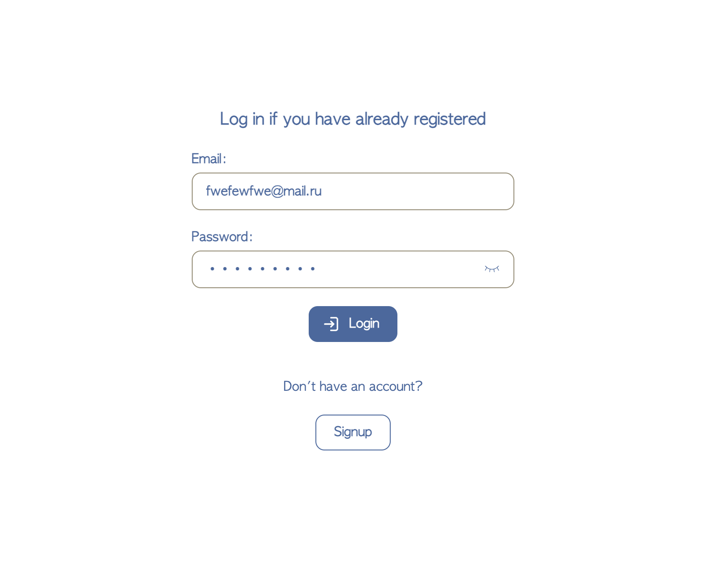
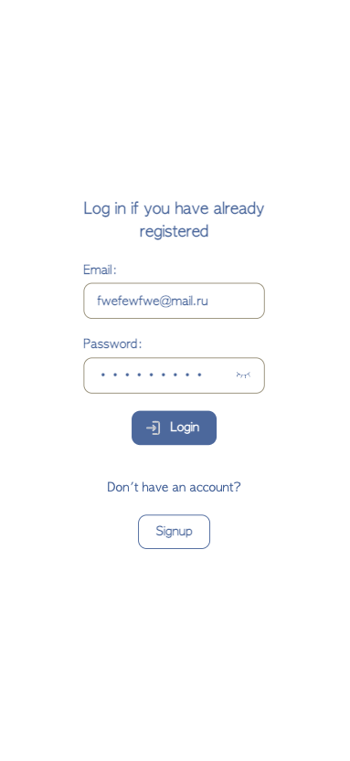

# Auth
Login form

## Stack
React, Typescript

## How to start

```
cd frontend
npm i
npm run start
```

## Not touched


## Not valid email


## Not valid password length


## Not valid password without number


## Not valid password without special char


## Valid with hidden password


## Valid with opened password


## Small screen


## Mobile screen

